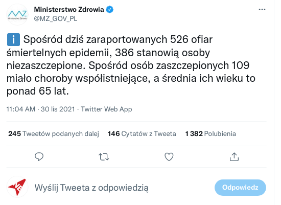

**Spoiler alert**: dane dotyczące zgonów osób szczepionych świadczą o wysokiej skuteczności szczepionek.

Zacznijmy od rozważenia następującego przypadku: gdyby wszyscy byli zaszczepieni, to 100% zgonów byłoby wśród osób szczepionych. Gdyby szczepionka nie działała zupełnie, a zaszczepionych byłoby 10%, to 10% zgonów byłoby wśród osób szczepionych.

Zacznijmy więc od faktów. Ministerstwo Zdrowia wrzuciło niedawno takiego Tweeta [1]:

Prosta matematyka - 386 podzielić przez 526, wychodzi 73% zgonów wśród osób nieszczepionych. W Polsce 55% populacji jest zaszczepionych przynajmniej jedną dawką [2], czyli **niezaszczepieni stanowiący 45% populacji stanowią 75% zgonów**. Samo to jest już dowodem na skuteczność szczepień w ochronie przed śmiercią.

Ale tutaj czynimy pewne założenia o jednorodności populacji. Nie są one prawdziwe, bo nie wszystkie grupy wiekowe są zaszczepione w równym stopniu, i nie wszystkie grupy wiekowe mają to samo ryzyko zgonu.

Olbrzymią większość zgonów stanowią osoby starsze [3]. Ale czy osoby starsze stanowią olbrzymią większość populacji Polski? Nie [4].

Pozwoliłem zrobić sobie wykres na podstawie danych GUS:

### Źródła

[1] [Wspomniany Tweet MZ](https://twitter.com/MZ_GOV_PL/status/1465622880134254595)

[2] [Polska na 23. miejscu w UE pod względem odsetka zaszczepionych osób](https://300gospodarka.pl/wykres-dnia/polska-miejsce-w-europie-szczepienia-covid-19)

[3] [Udział procentowy grup wiekowych w ogólnej liczbie zgonów z powodu COVID-19](https://www.gov.pl/web/gis/udzial-procentowy-grup-wiekowych-w-ogolnej-liczbie-zgonow-z-powodu-covid-19)

[4] [Ludność. Stan i struktura ludności oraz ruch naturalny w przekroju terytorialnym (stan w dniu 31.12.2019)](https://stat.gov.pl/obszary-tematyczne/ludnosc/ludnosc/ludnosc-stan-i-struktura-ludnosci-oraz-ruch-naturalny-w-przekroju-terytorialnym-stan-w-dniu-31-12-2019,6,27.html)
