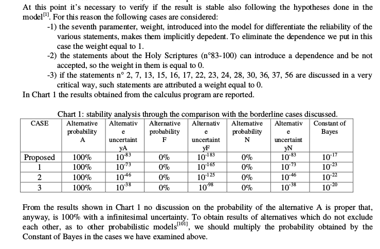

Jak wiedzą niektórzy, w dyskusjach o Całunie Turyńskim pojawia się hasło, że <q>naukowcy dzisiaj oceniają, iż prawdopodobieństwo tego, że Całun nie pochodził od ciała Jezusa Chrystusa, wynosi na 1 do 10 miliardów</q>. Czasem tą liczbą jest 200 miliardów.

Dla czytelnika mającego choć śladowe pojęcie o metodach jakich używa historia, absurdalny jest pomysł _liczenia prawdopodobieństwa przeszłości_, nie jest jasne jak miałoby się to odbywać. Zawsze więc uśmiechałem się z politowaniem.

I to był błąd, bo przegapiłem jedno z najlepszych źródeł lol contentu, doskonały przykład **jak nie należy robić nauki**. Jest to praca naukowa _Results of a probabilistic model applied to the research carried out on the Turin Shroud_, autorstwa [Giulio Fantiego](https://www.researchgate.net/profile/G_Fanti). Giulio Fanti to znany polimat, którego oddaniu wierze katolickiej dorównuje tylko jego wszechstronna wiedza. W ramach swoich badań nad CT, mimo wykształcenia w zakresie inżynierii przemysłowej, publikuje także artykuły z zakresu optyki, historii tkanin, fizyki wysokich energii, stężenia pośmiertnego, medycyny sądowej, procesów stochastycznych, trzęsień ziemi, udziela wywiadów, pisze książki.
<!--more-->
A, publikuje też artykuły naukowe w swojej dziedzinie.

### Konflikty interesów

Ten artykuł nie był przez nikogo dofinansowany. Mimo że jestem ateistą, starałem się by moje poglądy na temat istnienia Boga nie miały żadnego wpływu na treść zarzutów stawianych tekstowi i w zasadzie uważam że wierzący katolik powinien je uznać bez żadnej szkody dla swojej wiary, a nawet wiary w autentyczność Całunu Turyńskiego (choć rzuca on dość negatywne światło na jednego z najważniejszych badaczy Całunu i jego uczciwość naukową).

### Od abstraktu

Pełny tekst artykułu jest dostępny do pobrania na [ResearchGate](https://www.researchgate.net/publication/228581923_Results_of_a_Probabilistic_Model_Applied_to_the_Research_carried_out_on_the_Turin_Shroud), czytelników sceptycznych wobec moich opinii lub z nadmiarem wolnego czasu zapraszam do poczytania.

> A probabilistic model, capable to consider mutually excluding events, is been applied to 100 statements
  derived from the research done on the Turin Shroud.
  The 3 different alternatives are here defined as: A “the Shroud is authentic”; F “it is a medieval fake”; N “it
  is neither A nor F”.
  Each statement is characterized by 7 subjective coefficients, 3 regarding the probability of each alternative
  A, F or N, 3 the uncertainty of the probabilities and 1 to express the scientific importance of the statement.
  The 700 parameters have been elaborated by a “Mathcad 7” software to obtain the following result: the
  Turin Shroud is authentic with a probability of 100% and a corresponding uncertainty of 10-83.
  
Model na 700 parametrów - brzmi nieźle, nie? Matematyczna precyzja. I to jeszcze jaka precyzja - nawet Model Standardowy, jedna z najlepiej przetestowanych teorii fizycznych nie jest tak dokładna.

> the cardinal Ballestrero said: “Why don’t we want to consider among the possible causes also that of God’s supernatural intervention?”

Dobre pytanie, czemu nauka nie bada prawdopodobieństwa interwencji Boga? Pytanie pozostawię dla czytelnika.

> The analysis begins synthesizing three possible, but among each other mutually excluding alternatives, the
  most plausible hypotheses regarding the TS origin. They are called A, F, N and are here described as
  follows:
> 1) Alternative A: the TS is authentic. It wrapped Jesus’ body, a Hebrew male around thirty
  years of age, who lived in Palestine about 2000 years ago. (...)
> 2) Alternative F: The TS is false, medieval or post-medieval: (...)
> 3) Alternative N: the TS is not authentic, but it is neither false, medieval nor post-medieval; (...) The alternative N includes for instance the hypothesis that the sheet wrapped Jesus’ body, but the image was realized subsequently by a hypothetical forger; that the sheet wrapped the body of any man (but not Jesus) crucified according to the techniques used by the Romans in the I cent. A.D.
  
Jest to oczywiście bardzo nieortodoksyjne podejście, dotychczas statystycy przyjmowali tylko [hipotezę zerową i hipotezę alternatywną](https://pl.wikipedia.org/wiki/Weryfikacja_hipotez_statystycznych#Sformu%C5%82owanie_hipotezy_zerowej_i_alternatywnej). Rewolucyjnym krokiem jest tutaj więc wprowadzenie trzech hipotez alternatywnych, bez hipotezy zerowej. 

### Model

Poza zarzutem całkowitego niezrozumienia prawdopodobieństwa warunkowego, warto zwrócić uwagę, że zdania są traktowane jako całkowicie niezależne. Dalej będzie to dobrze widoczne - np. <q>człowiek Całunu został pochowany w Palestynie</q> i <q>człowiek Całunu przed śmiercią był w Palestynie</q> potraktowane są jako całkiem niezależne - zupełnie jakby zwłoki teleportowały się cały czas. 

Podstawowym problemem modelu jest fakt, że **gdyby założyć, że wszystkie tezy z artykułu są prawdziwe z prawdopodobieństwem 100%, za wyjątkiem np. tej o datowaniu radiowęglowym, która byłaby fałszywa z prawdopodobieństwem 99.9%, to wedle modelu Całun nadal pochodziłby z I wieku z prawdopodobieństwem niemal nieskończenie bliskim 100%**.

### 3a) Cloth

Mamy tutaj takie zdania:

> 1) It has the characteristics of a Jewish burial cloth of the I cent. A.D. The corpses were buried integral, with eyes and mouth closed, and with aloe and myrrh [6] . [a=.45, f=.05, n=.5, i a =.1, i f =.02, i n =.1, p=1]

Pomyślmy chwilę o tym. Załóżmy na chwilę, że temu zdaniu przypiszemy pełną prawdziwość, _wiemy_ że jest prawdziwe. Spójrzmy ponownie na abstrakt. Z prawdziwości tego zdania jest wywiedziona prawdziwość <q>alternative A</q>.

Na podstawie czego wywiedzione są niepewności? Nie wiadomo. Autor je sobie założył.

> 4) Supposing authentic the Sudarium of Oviedo 5 , from the strict correlation showed, it results that the TS
  is authentic too. The linen threads of the Sudarium, with “Z” twisting, are analogous to those of the TS
  and superimposing studies with polarized light and computerized comparison identify 70 bloodstains fitting
  together between the TS’s face and the Sudarium of Oviedo [13] [**a=.98**, f=.01, **n=.01**, i a =.15, i f =.005, i n =.005, p=2]

Załóżmy, że rzeczywiście, są sobie całun i chusta, w których najwyraźniej pochowano człowieka. Jest 98% szans, że był to Jezus z Nazaretu, 1% szans, że był to np. losowy człowiek ukrzyżowany przez Rzymian, i 1% szans, że to fałszerstwo.

{:class="img-responsive"}

### 3b) Microparticles

W zasadzie każde zdanie tutaj ma 50% szans, że albo w Całun był zawinięty Jezus albo losowy ukrzyżowany. Taki rzut kostką - albo był albo nie był.

Zauważalne jest też, że mocno krytykowane badania o pyłkach mają przypisane bardzo wysokie wartości prawdopodobieństwa, rzędu 90%.

> 17) The wax drops show that the TS could have been used like altar-cloth [39] . The wax is not dated. It
  doesn’t result that the TS was used like altar-cloth from the Middle Ages on. Candles could have maybe
  caused the ancient burnings, also transferred in the Pray Manuscript of Budapest in 1192-95 . [**a=.89**, f=.01,
  n=.1, i a =.05, i f =.005, i n =.05, p=1]
  
Jeśli Całun był używany jako obrus na ołtarzu, znaczy że jest to całun Jezusa. Brzmi jak rozsądne wnioskowanie dedukcyjne.

### 3c) Blood

Tutaj mamy już ciekawsze wnioski.

> 18) The red covering of the linen threads is blood [34] [43] identified of human kind of AB group [34][44] . This
  is confirmed by various specific analyses 10 . [a=.9, f=.01, n=.09, i a =.04, i f =.005, i n =.04, p=3]

Jeśli na Całunie znajdziemy krew, to jest 90% szans, że jest to krew Jezusa z Nazaretu i 1% że jest on fałszerstwem.

Ponownie można postawić tu zarzut, że mocno krytykowane badania (np. o poprawnym anatomicznie spływie krwi) mają przypisane tak wysokie poziomy pewności i jakoby potwierdzają one że jest to Jezus z Nazaretu, a nie np. jakikolwiek ukrzyżowany z Palestyny.

### 3e) Other images

> 49) The coin, a dilepton lituus, placed on the right eyelid dates back the TS around 30 A.D.. The coin
  was coined under Pontius Pilate in 29-30 A.D. (from the letters “IS”: I=10, S=6; sixteenth year of the
  Emperor Tiberius) [79] 26 . [a=.8, f=.001, n=.199, i a =.1, i f =.0005, i n =.1, p=1.5]
  
Po raz kolejny zwraca uwagę dziwny współczynnik `p` (jest użyty jako ważność). Z jakiegoś powodu moneta Piłata ma jedynie odrobinę większą wagę w potwierdzaniu autentyczności Całunu niż fakt, że przed śmiercią miał iść boso (9, `p=1`).

### 3f) Man

> The imposing, sad serenity of the face, that is in contrast with the numberless traumas suffered by the
  MTS, let us think that he is not a common man: he has closed eyes, but he has no sense of death. A
  hypothetical forger would have had not few difficulties to reproduce it [3] . [a=.999, f=.0005, n=.0005, i a =.0003,
  i f =.0002, i n =.002, p=2]
  
Czy my naprawdę powołujemy się na odczucia dotyczące wyrazu twarzy na mało wyraźnym całunie? Zwraca uwagę `p=2`.

> 52The MTS is a Jewish considering the somatic features of the face. One notices the stretched nose, the
  closeness of the eyes to the nose, the fullness of the lower lip [16] . [a=.7, f=.01, n=.29, i a =.1, i f =.005, i n =.1, p=1]
  
Nawet jeśli pominiemy fakt krytyki, że twarz z Całunu wygląda raczej na europejską, to naprawdę sądzimy że:
* Fałszerz nie wiedział (`f=.01`) jak wyglądają Żydzi (szczególnie że Całun po raz pierwszy _wypłynął_ na Wschodzie)?
* Fałszerz nie wiedział, że Jezus był Żydem?
* Żyd z XIX-wiecznego stereotypu wyglądał tak samo jak Żyd z Judei?

> 67) The MTS was not Roman. The scourging was reserved to not Roman citizens except for crimes of
  great gravity [89] . [a=.49, f=.01, n=.5, i a =.2, i f =.005, i n =.2, p=.7]
  
Jak wiadomo, krzyżowanie nie było karą przewidzianą za <q>crimes of great gravity</q>.

### 3g) History

> 74) The TS was showed in Edessa before 944 A.D.. In 525 A.D. one discovered in Edessa, today Urfa, an
  [acheropite image](https://pl.wikipedia.org/wiki/Acheiropoietos) (not painted by human hands) of the Holy Face [91]33 . [a=.9, f=.01, n=.09, i a =.04, i f =.005, i n =.04,  p=.4]
  
Po raz pierwszy policzono prawdopodobieństwo istnienia Boga i jest 90-99% że Bóg istnieje i jest to chrześcijański Bóg. Ale jeśli Bóg czyni cuda związane z Całunem, ma to wagę `p=0.4` dla potwierdzenia autentyczności Całunu.
  
> 82) Julius II with a Bull of 1506 instituted the “Mass of the Holy TS”, approves its canonic Office and
  establishes the date of the liturgical feast on May 4. Moreover Pius XI defined it “certainly not a human
  work”, John XXIII said “Here there is God’s finger”, Paul VI pointed out “the mystery of this astonishing,
  mysterious relic” and John Paul II said “a relic certainly it is” and “it is a mute witness but in the same time
  surprisingly eloquent” [97] . [a=.9, f=.01, n=.09, i a =.04, i f =.005, i n =.04, p=.7].
  
Długie wyliczenia są jasne - **skoro Całun był uznawany za autentyczny, musiał być autentyczny**. Na samej tej podstawie model uzyskuje prawdopodobieństwo ponad 99% że Całun jest autentyczny.

### 3h) ANALOGIES BETWEEN THE MTS AND CHRIST, FROM THE OLD AND THE NEW TESTAMENT 34

Tutaj następuje długie wyliczenie obrażeń których miał doznać Jezus na drodze na Golgotę. Jak wiadomo, wszystkie te fakty byłyby znane fałszerzowi, mimo to w zasadzie wszystkie zdania tutaj mają przypisaną moc potwierdzającą autentyczność na poziomie 98%.

> On the TS one can admire the sign of the salvation (the resurrection).

Przypominam, jest to artykuł udający naukowy.

## Conclusions

{:class="img-responsive"}

Jak widać, powyższe hipotezy, z _rzetelnie_ przypisanymi wagami i prawdopodobieństwami pokazują nam, że Chrystus prawdziwie zmartwychwstał, zostawiając za sobą Całun. Nie jest jednak jasna interpretacja tego, że mimo 100% szans na zmartwychwstanie, jest tylko 90-99% szans na istnienie Boga.

## Inne zastosowania modelu

Jeśli zastosujemy część elementów modelu do koszulki pobrudzonej krwią nastolatka, który nadział się na płot, uzyskamy 99% prawdopodobieństwo, że to krew Chrystusa. Wyliczenia pozostawiam do samodzielnego wykonania.

## Paweł z Tarsu na dziś:

> Ale jeżeli przez moje kłamstwo prawda Boża tym więcej się uwydatnia ku Jego chwale, jakim prawem jeszcze i ja mam być sądzony jako grzesznik? I czyż to znaczy, iż mamy czynić zło, aby stąd wynikło dobro? - jak nas niektórzy oczerniają i jak nam zarzucają, że tak mówimy. Takich czeka sprawiedliwa kara. 

[Rz 3:7-8](http://biblia.deon.pl/rozdzial.php?id=272).
