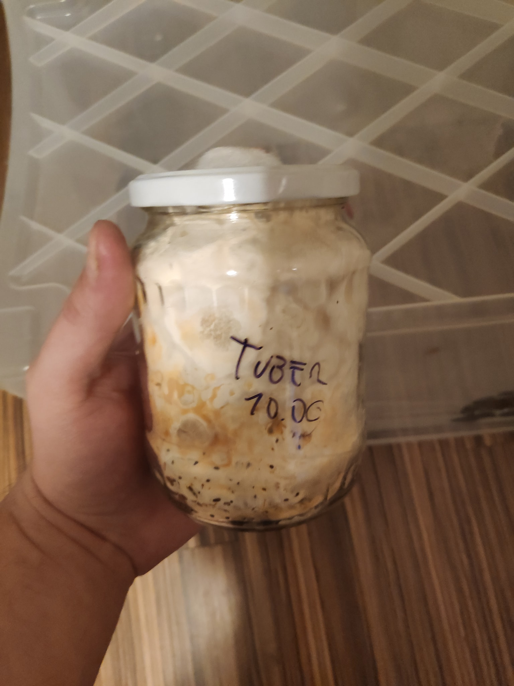

Wiele osób pyta mnie "o co w ogóle chodzi z uprawą grzybów"? Otóż grzyby można uprawiać. Najważniejsze ekonomicznie są pieczarki i boczniaki, bardzo łatwe w uprawie gatunki, dlatego możecie znaleźć je na półce w sklepie cały rok.  Po więcej szczegółów dotyczących teorii zapraszam do swojego [artykułu na Wikipedii](https://pl.wikipedia.org/wiki/Uprawa_grzyb%C3%B3w).

# Uprawa grzybów bezwysiłkowa

Najprostszym rozwiązaniem jest wpisanie w wyszukiwarkę haseł takich jak "balot boczniaka", "kostka pieczarki", "kostka shitake". Można kupić tam już skolonizowane substraty, które wystarczy umieścić w odpowiednich warunkach i czekać na zbiory. To doskonały pomysł by wspomóc polską gospodarkę i rozwijać w sobie tę pasję.

Co jeśli jednak nam to nie wystarcza?
<!--more-->
# Cykl życia grzyba w domowej uprawie

Grzyb zwykle przechodzi przez następujące etapy: 

* Umieszczenie na **agarze** fragmentu grzyba lub zarodników
* Wzrost na **agarze**
* Umieszczenie na **zaszczepiaczu**
* Wzrost na **zaszczepiaczu**
* Mieszanie **zaszczepiacza** z **substratem**
* Wzrost w **substracie**
* Owocowanie

Jest to bardzo porządny cykl, a metody które pomijają któryś z etapów, takie jak często używane przez początkujących hodowców nielegalnych grzybów psylocybowych wstrzykiwanie zarodników bezpośrednio w zaszczepiacz i owocowanie bezpośrednio z niego, są obarczone wyższym ryzykiem niepowodzenia i mniejszymi plonami.

# Co trzeba by zacząć uprawę grzybów od zera?

By przeprowadzić uprawę grzybów od zera, będziemy potrzebować **metody zapewniania sterylności przy pracy** , **metody zapewnienia sterylności zaszczepiacza** i **metody zapewnienia odpowiedniego środowiska owocowania**. Tylko dwa pierwsze wymagają nietypowego sprzętu.

## Sterylność przy pracy

Kiedy będziemy pracować z agarem lub zaszczepiaczem, musimy zrobić wszystko, by nie dostały się tam zakażenia (por. [poradnik identytikacji zakażeń grzybni z psilosophy](http://psilosophy.info/zakazenia_grzybni.html)).

By tego uniknąć, można stosować kilka metod:
* [Komora laminarna](https://upload.wikimedia.org/wikipedia/commons/b/be/Laminar_flow_hood.jpg) (ceny zaczynają się od 1500zł)
* **Still air box** (**SAB**) - samodzielna produkcja to koszt w wersji ultrabudżetowej mniej niż 15zł, w normalnej - koło 50zł.

### Jak działa still air box?

W powietrzu cały czas krąży olbrzymia ilość bakterii i zarodników pleśni. Komora laminarna pompuje powietrze przez filtr HEPA, a cała praca odbywa się w strumieniu powietrza wolnego od jakichkolwiek bakterii i pleśni.

Zasada działania **Still air box** opiera się na tym, że w nieruchomym powietrzu te bakterie i pleśni opadają. 

{:class="img-responsive"}

Na zdjęciu SAB z którego obecnie korzystam. Jest wykonany z 130L pojemnika IKEA Samla, który kosztował 50zł, a otwory w nim zostały wycięte rozżarzonym skalpelem. Całość na balkonie, by zminimalizować smród topionego plastiku. Mniej estetyczne dziury uzyskamy korzystając z noża do tapet, plastik ma tendencje do pękania.

## Sterylność zaszczepiacza

**Zaszczepiacz** (będzie o nim więcej w następnym odcinku) to najczęściej **sterylizowane żyto**. Umieszcza się go w pojemnikach z filtrem powietrza.

Pojemnikiem mogą być specjalistyczne torby do uprawy grzybów (do kupienia na Aliexpress), ale można używać też **słoików z zmodyfikowanymi pokrywkami**.

{:class="img-responsive"}

### Słoiki ze zmodyfikowaną pokrywką

Będziemy potrzebować **wiertła do metalu ~6mm** i **włókniny poliestrowej**. Wiercimy w pokrywce, nienałożonej na słoik, otwór. Wkładamy w niego odrobinę włókniny, by dokładnie go zatkać, ale bez nadmiernego zbijania materiału.

## Sterylizacja zaszczepiacza

Zaszczepiacz sterylizować najłatwiej w **szybkowarze**. Jest to opcja znacznie tańsza niż autoklaw (od 1500zł używany; nowe od 3000), a wystarczająca dla naszych potrzeb.

Szybkowar powinien osiągać temperaturę **121** stopni, która zabija endpospory bakterii z rodziny _Bacillaceae_. By szybkowar osiągał temperaturę 121 stopni, powinien utrzymywać ciśnienie co najmniej **15 psi** (~**1 bar**). Większość szybkowarów na rynku pozwala osiągnąć  ciśnienie do 10 psi (0.7 bara), co jest niewystarczające do sterylizacji.

Oznaczenie ciśnienia znajduje się **najczęściej w instrukcji lub na dnie**. Musisz pytać sprzedawców lub oglądać je osobiście. Nie polecam bawić się w modyfikację szybkowarów, bo nieprawidłowe jej wykonanie może zaskutkować wybuchem.

# Proponowana lista zakupów

Proponuję kupić:

* IKEA Samla 130L (50zł)
* Trzonek do skalpela typu 3 (~7zł)
* Ostrza do skalpela nr 11 (18zł/100 sztuk)
* Szalki Petriego 90mm (15zł/25 sztuk; początkującym zalecam kilka zestawów do ćwiczeń)
* Agar (22zł/200g)
* Jedno z podłóż:
** Ekstrakt słodowy jasny w proszku (13zł/0.5kg)
** Płatki ziemniaczane (13zł/1kg)
* Folię spożywczą (9zł/duża rolka)
* Szybkowar (najdroższy element zestawu - najtańszy, nowy, markowy szybkowar jaki znalazłem to Kinghoff KH-4807 za 216zł)
* Włóknina poliestrowa 300g/m2 (10zł/dożywotni zapas)

Łącznie **360zł**. 

Zakładam, że masz lub możesz pożyczyć:

* Wiertło do metalu 6mm
* Palnik spirytusowy lub inny
* Wiertarkę
* Słoiki z pokrywkami do poświęcenia

Pakiet **premium**:
* Ezy bakteriologiczne (3zł/10 sztuk)
* Biologiczne testy sterylizacji (55zł/10 sztuk)
* Lepszy szybkowar (ceny do 3000zł za urządzenia do naprawdę masowej sterylizacji)
* Płatki drożdżowe (10zł/150g, starczy na lata)

## Proponowana lista zakupów na przyszłość

Dokładniejsze omówienie tematu substratów i pojemników będzie w przyszłości.

* Spryskiwacz, pusty.
* Żyto (3kg wystarczą na wiele miesięcy pewnie)
* Substrat stosowny do gatunku:
  * Słoma (tania, ale **trudna do użycia w mieszkaniu**): boczniaki oprócz boczniaka królewskiego, _Cyclocybe aegerita_.
  * Włókno kokosowe (uniwersalne, łatwe do użycia, **drogie**): _Psilocibe cubensis_, boczniak ostrygowaty. Uniwersalne, większośc gatunków rośnie.
  * Wióry drewne z drzew liściastych: reishi, shiitake, soplówka jeżowata, boczniak królewski, inne boczniaki, _Psilocibe azurescens_.
    * Pelet też daje radę, ale jest wolniej kolonizowany.
  * Kompost: pieczarki.
* Pojemnik stosowny do gatunku i chęci:
  * Worki z filtrem do uprawy grzybów (ang. _[mushroom] bags_): praktycznie każdy gatunek, zwłaszcza owocujące poziomo (boczniaki).
  * Plastikowe pudełka na buty (np. Curver Clearbox 5.7l, pot. _shoebox_): reishi, _Psilocibe cubensis_, pierścieniak uprawny, pieczarki.
  * Plastikowy pojemnik 75 litrów (pot. _monotub_): większa produkcja gatunków możliwych do uprawy w pudełkach na buty. Można układać je na sobie dla jeszcze większej produkcji z tej samej przestrzeni.

Pakiet **premium**:
* Otręby pszenne (3.5zł/kg)
* Filtry HEPA
* Wentylatory
* Automatyczne nawilżacze powietrza
* Szklarnia balkonowa

