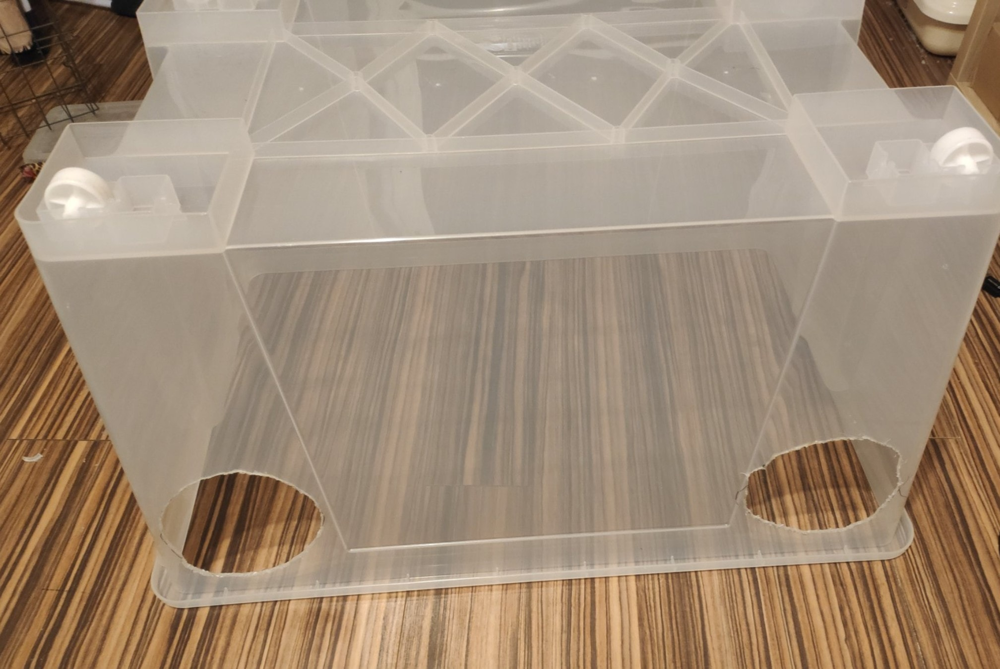

[Poprzednia część](https://ginden.github.io/blog/uprawa-grzybow-1/).

## SAB

Profesjonalne prace sterylne prowadzi się z użyciem komory laminarnej. Przez dobrej jakości filtr HEPA (o oczkach tak małych, że zatrzymują nawet pojedyncze bakterie), potężny wiatrak pompuje powietrze, co odrzuca jakiekolwiek zanieczyszenia spoza pola pracy. Ceny zaczynają się [od 2500zł na Chemlandzie](https://sklep-chemland.pl/pl/urzadzenia-chemland/komory-laminarne/komora-laminarna.html). Dość droga zabawa.

Prawdopodobnie nie masz 2500zł na zbyciu, więc naszym półśrodkiem będzie SAB - still-air box.

<!--more-->

Zasada działania SABa jest dość prosta - pozwalamy w pomieszczeniu i w boxie opaść wszelkim bakteriom, kurzowi, zarodnikom pleśni na dno (podłogę czy blat). Takie powietrze jest względnie sterylne. Przez ostrożne ruchy (bo każdy gwałtowny ruch może podnieść pył) unikamy zakażeń przy naszych działaniach. 

## Wykonanie SAB

{:class="img-responsive"}

Tak wygląda mój SAB (still air box). Jest wykonany z [IKEA SAMLA 130l](https://www.ikea.com/pl/pl/p/samla-pudelko-przezroczysty-90102971/) (50zł).

### Ale to za drogo...

[Najtańszy działający SAB wygląda tak](https://www.shroomery.org/forums/showflat.php/Number/11688596#11688596). Zrobisz go za... 10zł?

## Właściwy rozmiar

Użytkownicy forum [shroomery.com](https://www.shroomery.org/forums/postlist.php/Board/2) polecają rozmiary od 60 litrów w górę.

## Wykonanie otworów na ręce

Otwory na ręce powinny umożliwiać Ci swobodny dostęp do całego wnętrza SABa. Rozmiar zależy od rozmiaru Twoich rąk. Przy większym SABie powinny Ci wchodzić nawet do łokci, przy mniejszym mogą wystarczyć tylko do nadgarstków.

#### Palnik spirytusowy + skalpel

Ja swój SAB zrobiłem korzystając z palnika spirytusowego, balkonu, trzonka skalpela i ostrzy skalpela. Najpierw narysowałem względnie okrągłe otwory na ręce markerem. Następnie wyszedłem na balkon, i nagrzewając ostrze do czerwoności nad palnikiem spirytusowym ciąłem plastik. Gdybym robił to w domu, puściłbym wentylator tak, żeby opary przypalanego plastiku nie dostawały się do moich płuc (na szczęście na balkonie wiało).

#### Użycie otwornicy

Możesz też po prostu użyć [otwornicy](https://www.google.com/search?q=otwornica+150mm&tbm=isch). Moje otwory na ręce mają około 150mm - ceny tak dużych otwornic krążą w okolicach 120zł.

Znacznie tańszą alternatywą wydaje się **cyrkiel do wycinania otworów**, dostępny też pod nazwą *uniwersalny wycinak otworów*. 
