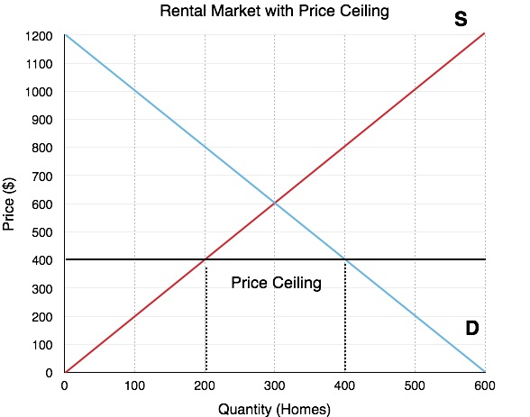

...i dlaczego powinno się walczyć z każdą próbą jej wprowadzenia w Twoim mieście.

Ten post to tłumaczenie. [Oryginalny post na Reddicie](https://www.reddit.com/r/neoliberal/comments/q77xjz/rent_control_why_people_think_it_works_why_it/).

Dyskusja o kontroli czynszów powinna być martwa i pogrzebana od kiedy ktoś zrobił [ten model cen maksymalnych na dobra](https://pressbooks.bccampus.ca/uvicecon103/wp-content/uploads/sites/58/2016/11/Figure-4.6a.jpg)

Jako że miasta na całym świecie borykają się z problemem dostępnych cenowo mieszkań, ludzie szukają najłatwiejszego rozwiązania jakie potrafią i znaleźć, i znajdują [kontrolę czynszów](https://en.wikipedia.org/wiki/Rent_regulation).

### Dlaczego ludzie myślą, że to działa

> Chciwi landlordowie wspierani przez chciwych bankierów zarabiają na zwiększaniu czynszów, wymuszając wyprowadzki i zagrażając spójności społecznej i niszcząc podstawy naszej społeczności

Ludzie chcą, by czynsze były niższe na obszarach o niskiej podaży i wysokim popycie na mieszkania, i ich wybraną polityką by osiągnąć ten cel jest kontrola czynszów. Jakie lepsze rozwiązanie jest niż zakazanie landlordom podwyższania czynszów?

### Dlaczego to nie działa

Ekonomistom wiadomo od dawna, że kontrola czynszów jest złym rozwiązaniem problemu dostępności mieszkań. Już od lat czterdziestych wiadomo, że kontrola czynszów przyczynia się do nadmiernej konsumpcji [1], doprowadzania budynków do ruiny [2], sprzedaży mieszkań i zwiększenia cen dla większości populacji [3].

Wiemy też, że jeśli kontrola czynszów trwa odpowiednio długo, wykształcają się dwie klasy najemców [4]. Bogaci, długoterminowi najemcy, którzy wynajmują mieszkanie z trzema sypialniami za mniej niż 1500 dolarów, podczas gdy studenci mają problem z znalezieniem kawalerki w tej cenie.

Od długiego czasu kontrole czynszów były promowane jako rozwiązanie problemu dostępności mieszkań, podczas gdy oczywiście nim nie są.

Nie tylko kontrola czynszów nie radzi sobie z rozwiązaniem problemu dostępności mieszkań, ale też zachęca (_incentivises_) ludzi by nie szukali lepszej pracy, bo straciliby swój dom z kontrolowanymi czynszami, i musieliby płacić prawdziwą cenę za cokolwiek nowego wynajmą

Badania pokazały, że kontrola czynszów zmniejszyła mobilność najemców o 20% w San Francisco [3], która jest silnie powiązana z produktywnością [4], która z kolei jest silnie powiązana z pensjami [5], co prawdopodobnie zmniejsza też ich pensje.

### Dlaczego powinno się sprzeciwiać kontroli czynszów w Twoim mieście/stanie/kraju

Dlaczego? Ponieważ [kontrola czynszów jest najskuteczniejszą metodą niszczenia miast oprócz bombardowania](https://www.bloomberg.com/opinion/articles/2018-01-18/yup-rent-control-does-more-harm-than-good). [Możesz sprawdzić w quizie, które zdjęcia są z miejsc objętych kontrolą czynszów, a które ze zbombardowanych](http://upsuckercreek.blogspot.com/2017/06/quiz-bombing-or-rent-control.html).

To oczywiście wielka hiperbola, ale to naprawdę destruktywna polityka i jeśli obchodzi Cię los Twojego miasta, wybór jest prosty.

Kontrola czynszów tworzy prawa nabyte i jest wyjątkowo trudna do usunięcia. Pomyśl o kontroli czynszów jako o wielkim transferze od najemców w przyszłości do najemców teraźniejszych. Najemcy w przyszłości będą płacić wyższe czynsze, by najemcy dzisiaj mogli cieszyć się niskimi czynszami i zadbanym budownictwem. Ale trzeba zwrócić uwagę, że najemcy przyszłości nie mogą głosować i nie są w żaden sposób reprezentowani w dyskusji na temat kontroli czynszów.

Jak w przypadku wielu innych regulacji, to głównie egoistyczni ludzie budują zamek i zamykają za sobą bramę. 

Kontrola czynszów jest też trudna do usunięcia, bo to ulubiony typ polityki dla polityków. Jakkolwiek krótkowzroczna jest, powoduje że obecni wyborcy zyskują na jakiś czas. Czas na tyle długi, by polityk przestał być politykiem w mieście, i jak wspomniano wcześnie, obecni najemcy osiągają krótkoterminowy zysk. Ale kiedy głosujesz za jakąś polityką, i decydujesz po której stronie się opowiedzieć, powinieneś myśleć o wszystkich, także o ludziach, którzy jeszcze się nie urodzili. Oni też mają prawo do mieszkania. Jakie Ty masz prawo, by im je zabrać?

### Ale kontrola czynszów w moim mieście nie obowiązuje nowych budynków. W jaki sposób wpływa to na podaż mieszkań?

Istnieje kilka sposobów w jaki może się to stać, i zarysuję szybko dwa z nich.

Może to zmniejszyć podaż mieszkań przez stworzenie oczekiwań, że kontrola czynszów będzie rozszerzona na inne mieszkania, czyli osoby będące właścicielami budynków będą żądać większych stawek za ponoszenie takiego ryzyka. Kontrola czynszów w Berlinie zwiększyła czynsze w budynkach nieobjętych regulacjami [6], mimo że nowe budynki są z nich wyłączone [7]. Berlin jest też przykładem, jak kontrola czynszów jest rozszerzana na kolejne budynki, podobnie jak San Francisco.

Tworzy to też dla regularotów problem niemożliwy do rozwiązania. Muszą wybierać pomiędzy zapewnianiem nowego budownictwa i osiąganiem jednego z głównych celów kontroli czynszów - zatrzymaniem długoterminowych rezydentów. Jeśli kontrola czynszów dotyczy wszystkich budynków zbudowanych przed jakąś datą, to co zatrzymuje właścicieli przed rozbiórką budynku i zbudowaniem nowego? Mogą być przepisy powstrzymujące takie zachowania, ale ogranicza to podaż nowych mieszkań, która jest jedynym długoterminowym rozwiązaniem problemu dostępności mieszkań. Jeśli rząd stwierdzi, że w takim nowym budynku muszą być zapewnione mieszkania dla dotychczasowych mieszkańców, mniej mieszkań będzie budowanych ze względu na obniżenie spodziewanej stopy zwrotu inwestycji. Zagadka dla zwolenników kontroli czynszów.

### Ale moje miasto nie wprowadza kontroli czynszów, tylko stabilizację czynszów. Czy to nie jest coś innego?

Stabilizacja czynszów w dłuszej perspektywie to kontrola czynszów w innej formie. Jak wilk w owczej skórze, ma wszystkie wady kontroli czynszów wspomniane wcześniej, tylko ładniej wyglądające dla przeciętnego wyborcy.

Kiedy wprowadzasz stabilizację czynszów, wprowadasz po prostu odrobinę wyższy sufit cenowy niż byłby bez niej. Jest to mniej nieefektywne niż kontrola czynszów, ale spodziewana stopa zwrotu na inwestycjach w budowę mieszkań jest niższa niż byłaby bez kontroli cen, więc ilośc inwestycji też będzie mniejsza. Z drugiej strony, masz więcej inwestorów niż w mieście z pełnoskalową kontrolą czynszów, ale tylko dlatego, że sufit cenowy jest wyższy, co prowadzi do wyższej spodziewanej stopy zwrotu.

### Alternatywne rozwiązania, które działają i które powinieneś wspierać

Poparcie dla kontroli czynszów bazuje na przesłance, że chcemy więcej tanich mieszkań, by dotychczasowi mieszkańcy nie musieli się wyprowadzać w związku z wzrostami czynszów. Rozwiązaniem jest budować więcej mieszkań - im mniej ograniczamy budowę, tym więcej zostanie ich zbudowanych.

Czynsze wzrastają, ponieważ zapotrzebowanie na mieszkania przerasta podaż. Podobnie jak w przypadku każdego innego dobra, tylko że regulacje ograniczają podaż mieszkań na rynku. Jeśli te regulacje są zachowane, kontrola czynszów powoduje [grę w gorące krzesła](https://pl.wikipedia.org/wiki/Gor%C4%85ce_krzes%C5%82a) w całym mieście.

Część tekstu odnosi się do krajów anglosaskich, z ich bardzo specyficznymi problemami.

Badania RBA pokazało:

> Zoning zwiększa ceny domów jednorodzinny o 73% ponad koszt krańcowy w Sydney, 69% w Melbourne, 42% w Brisbane i 54% w Pertth. Zoning podniósł też ceny mieszkań, zwłaszcza w Sydney.

[Maybe we could solve it by abolishing zoning, perhaps](https://www.reddit.com/user/Globalist-Shill/comments/q4ki8g/abolish_zoning/)?

Inną polityką, którą można wprowadzić, jeśli chcemy pomóc długoterminowym mieszkańcom pozostać w ich mieszkaniach, jest wprowadzenie krótkoterminowych zasiłków dla ubogich, jeśli spełniają pewne wymagania. Szybko zarysuję jak mogą one wyglądać.

* Czynsze w danym miejscu musiały wzrosnąć ponad inflację o x%
* Mieszkali w danym miejscu ponad y lat
* Zasiłek wygaśnie po z latach lub jeśli czynsze wrócą do poprzedniego poziomu, skorygowane o inflację
* Zasiłek będzie miał górną granicę

By zapobiec nadmiernym wydatkom na zasiłki, trzeba też zaimplementować pewne marchewki/kije dla lokalnych samorządów jeśli chodzi o podaż mieszkań i ceny, jak [kalifornijskie RHNA](https://abag.ca.gov/our-work/housing/rhna-regional-housing-needs-allocation) minus [złe części](https://www.reddit.com/r/badeconomics/comments/iw1fao/bad_economics_in_california_housing_policy/).

Jeśli obszar będzie miał wyjątkowo duży wzrost czynszów, podaż mieszkań musi też znacząco wzrosnąć, by zrównoważyć popyt.  _The state government could fine councils if they don't meet those targets, but if that's unconstitutional, we could try carrots like parks and other amenities built for the area to cope with the increased population. This would also help garner support for increased development, because long-term residents would also have access to these amenities_.

Takie rozwiązanie może pomóc też osiągnąć cel utrzymania dotychczasowych mieszkańców, przeciwdziałając gentryfikacji , zwłaszcza krótkoterminowo, gdy podaż nie jest w stanie rosnąć tak szybko jak popyt, jak jest w przypadku mieszkań.

Podsumowując: można regulować ile się chce, ale nie ma takiej kontroli czynszów, niezależnie jak mądrzy ludzie by nad nią myśleli, która może zanegować podaż i popyt.

### Źródła

[1] Joseph Gyourko, Peter Linneman, [Equity and efficiency aspects of rent control: An empirical study of New York City](https://doi.org/10.1016/0094-1190(89)90027-2.)

[2] A Downs, Residential Rent Controls: An Evaluation

[3] [The Effects of Rent Control Expansion on Tenants, Landlords, and Inequality: Evidence from San Francisco](https://www.aeaweb.org/articles?id=10.1257/aer.20181289)

[4] [Berlin’s Rent Controls Are Proving to Be a Disaster](https://www.bloomberg.com/opinion/articles/2021-03-02/berlin-s-rent-controls-are-proving-to-be-the-disaster-we-feared)

[4] [Geographic Labour Mobility, Productivity Commission Research Report Overview](https://www.pc.gov.au/inquiries/completed/labour-mobility/report/labour-mobility-overview.pdf)

[5] [The Link Between Wages and Productivity Is Strong](https://www.aspeninstitute.org/wp-content/uploads/2019/01/3.2-Pgs.-168-179-The-Link-Between-Wages-and-Productivity-is-Strong.pdf)

[6] [Berlin’s Rent Cap Puts the Brakes on Rent for Existing Apartments, but Pushes Rent Up for New Buildings](https://www.ifo.de/en/node/52903)

[7] [Berlin's new rent freeze: How it compares globally](https://www.dw.com/en/berlins-new-rent-freeze-how-it-compares-globally/a-50937652)

[8] [The Effect of Zoning on Housing Prices](https://www.rba.gov.au/publications/rdp/2018/pdf/rdp2018-03.pdf)
